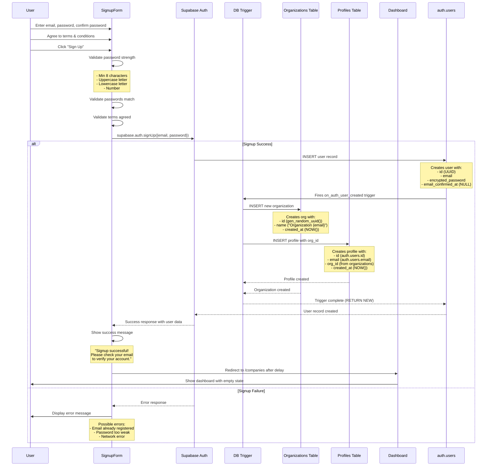
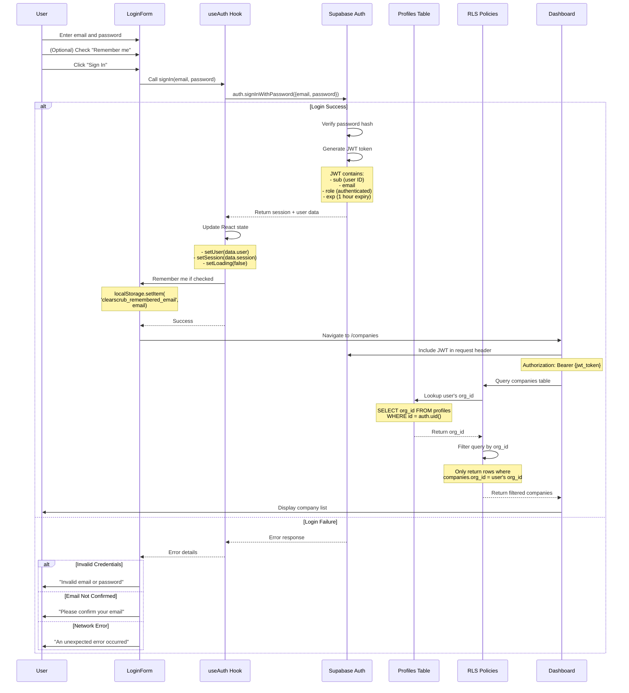

# ClearScrub Authentication Flows

**Last Updated:** October 21, 2025
**Status:** Production-Ready
**Project:** ClearScrub Dashboard + Supabase Backend

---

## Overview

This document provides detailed sequence diagrams and explanations for all authentication flows in the ClearScrub platform. Understanding these flows is critical for debugging authentication issues, extending functionality, and maintaining security.

---

## Table of Contents

1. [Signup Flow](#signup-flow)
2. [Login Flow](#login-flow)
3. [Session Management](#session-management)
4. [Protected Route Access](#protected-route-access)
5. [Error Handling](#error-handling)

---

## Signup Flow

### Sequence Diagram (Text-Based)



### Step-by-Step Explanation

#### Step 1: User Input Validation (Client-Side)

**Location:** `clearscrub_dashboard/src/pages/Signup.tsx` (lines 48-70)

**Validations Performed:**
1. **Password Strength:**
   - Minimum 8 characters
   - At least one uppercase letter
   - At least one lowercase letter
   - At least one number

2. **Password Confirmation:**
   - Password and confirm password must match exactly

3. **Terms Agreement:**
   - User must check the terms and conditions checkbox

**Why These Validations:**
- Prevents weak passwords (security)
- Catches user errors before API call (UX)
- Ensures legal compliance (terms agreement)

#### Step 2: Supabase Auth API Call

**Code:**
```typescript
const { data, error: signUpError } = await supabase.auth.signUp({
  email,
  password,
  options: {
    emailRedirectTo: `${window.location.origin}/companies`
  }
})
```

**What Happens:**
- Supabase creates record in `auth.users` table
- Password is hashed with bcrypt (never stored plaintext)
- User ID (UUID) is generated automatically
- `email_confirmed_at` is set to NULL (email not verified yet)

**Important Notes:**
- Email verification is NOT currently enabled (see Known Issues)
- Users can log in immediately without confirming email
- This should be changed before production launch

#### Step 3: Database Trigger Execution

**Trigger Name:** `on_auth_user_created`
**Trigger Function:** `handle_new_user()`
**Timing:** AFTER INSERT on auth.users
**Location:** `supabase/database/migrations/20251021_create_auth_trigger.sql`

**What the Trigger Does:**

1. **Generates Organization ID:**
   ```sql
   new_org_id := gen_random_uuid();
   ```

2. **Creates Organization:**
   ```sql
   INSERT INTO public.organizations (id, name, created_at)
   VALUES (
     new_org_id,
     COALESCE('Organization ' || NEW.email, 'Organization ' || NEW.id::text),
     NOW()
   );
   ```
   - Organization name defaults to "Organization {email}"
   - Example: "Organization john@example.com"
   - Users can change this later in settings (future feature)

3. **Creates Profile with org_id:**
   ```sql
   INSERT INTO public.profiles (id, email, org_id, created_at)
   VALUES (
     NEW.id,
     NEW.email,
     new_org_id,
     NOW()
   );
   ```
   - Profile ID matches auth.users ID (one-to-one relationship)
   - org_id establishes multi-tenant isolation
   - This is CRITICAL for RLS policies to work

**Why This Approach:**
- Atomic operation: if trigger fails, entire signup rolls back
- No race conditions: org_id assigned before user can make requests
- Zero application code: database handles complexity
- Guaranteed data integrity: can't have user without org

#### Step 4: Success Response and Redirect

**Frontend Handling:**
```typescript
if (data.user) {
  setSuccess(true)
  // Note: Actual redirect to dashboard will be handled in Phase 3
  // For now, just show success message
}
```

**Current Behavior:**
- Shows success message with email verification prompt
- User can immediately log in (email verification not enforced)
- Redirects to `/companies` dashboard
- Dashboard shows empty state: "Add your first company"

**Future Enhancement:**
- Enable email verification in Supabase settings
- Block login until email confirmed
- Add email verification UI page

---

## Login Flow

### Sequence Diagram (Text-Based)



### Step-by-Step Explanation

#### Step 1: User Authentication Request

**Location:** `clearscrub_dashboard/src/hooks/useAuth.tsx` (lines 47-64)

**Code Flow:**
```typescript
const signIn = async (email: string, password: string) => {
  setLoading(true)
  try {
    const { data, error } = await supabase.auth.signInWithPassword({
      email,
      password
    })

    if (error) throw error

    setSession(data.session)
    setUser(data.user)
  } catch (error) {
    throw error
  } finally {
    setLoading(false)
  }
}
```

**What Happens:**
1. Loading state set to true (shows spinner)
2. Supabase Auth API called with credentials
3. If successful: session and user state updated
4. If error: thrown to LoginForm for display
5. Loading state reset to false

#### Step 2: JWT Token Generation

**Supabase Auth Process:**
1. Verifies email exists in auth.users table
2. Compares provided password with stored bcrypt hash
3. If match: generates JWT token with claims:
   ```json
   {
     "sub": "user-uuid-123",
     "email": "user@example.com",
     "role": "authenticated",
     "aud": "authenticated",
     "exp": 1698345600,
     "iat": 1698342000
   }
   ```

**Token Expiry:**
- Default: 1 hour
- Supabase client auto-refreshes token before expiry
- Refresh token stored in secure httpOnly cookie

**Token Storage:**
- Stored in Supabase client memory (React state)
- NOT stored in localStorage (security best practice)
- Auto-included in all subsequent API requests

#### Step 3: Session State Management

**Auth Context Provider:** `clearscrub_dashboard/src/hooks/useAuth.tsx` (lines 24-95)

**State Variables:**
- `user`: User object from Supabase (email, id, metadata)
- `session`: Session object with JWT token
- `loading`: Boolean for loading state
- `isAuthenticated`: Computed boolean (!!session)

**Session Initialization:**
```typescript
useEffect(() => {
  // Get initial session on mount
  supabase.auth.getSession().then(({ data: { session } }) => {
    setSession(session)
    setUser(session?.user ?? null)
    setLoading(false)
  })

  // Listen for auth changes (login, logout, token refresh)
  const { data: { subscription } } = supabase.auth.onAuthStateChange((_event, session) => {
    setSession(session)
    setUser(session?.user ?? null)
    setLoading(false)
  })

  return () => subscription.unsubscribe()
}, [])
```

**Why This Approach:**
- Centralizes auth state in React Context
- Automatically syncs across all components
- Handles token refresh seamlessly
- Persists session across page reloads

#### Step 4: RLS Policy Enforcement

**Database-Level Security:**

When user makes API request to fetch companies:

1. **JWT Included in Request:**
   ```http
   GET /functions/v1/list-companies
   Authorization: Bearer {jwt_token}
   ```

2. **PostgreSQL Extracts User ID:**
   ```sql
   -- auth.uid() function extracts 'sub' claim from JWT
   SELECT auth.uid(); -- Returns user UUID
   ```

3. **RLS Policy Filters Query:**
   ```sql
   CREATE POLICY "Users see own org companies"
   ON companies
   FOR SELECT
   USING (
     org_id IN (
       SELECT org_id FROM profiles WHERE id = auth.uid()
     )
   );
   ```

4. **Query Automatically Filtered:**
   ```sql
   -- User's query:
   SELECT * FROM companies;

   -- Actual executed query (with RLS):
   SELECT * FROM companies
   WHERE org_id IN (
     SELECT org_id FROM profiles WHERE id = auth.uid()
   );
   ```

**Security Guarantee:**
- Users can ONLY see data for their organization
- Enforced at database level (can't be bypassed by malicious client)
- Zero application code required
- Automatic across all tables with RLS enabled

---

## Session Management

### Session Lifecycle

**Session Creation:**
- Happens during successful login
- JWT token generated with 1-hour expiry
- Refresh token stored for token renewal

**Session Persistence:**
- Stored in memory (React Context)
- Survives page reloads (Supabase auto-retrieves from secure storage)
- Does NOT survive browser close (by design, for security)

**Token Refresh:**
- Supabase client automatically refreshes token before expiry
- Refresh happens in background (user unaware)
- If refresh fails (e.g., user deleted): session ends, redirect to login

**Session Termination:**
- User clicks "Sign Out" button
- Token expired and refresh failed
- User deleted or disabled in Supabase

### Sign Out Flow

**Code:** `clearscrub_dashboard/src/hooks/useAuth.tsx` (lines 66-79)

```typescript
const signOut = async () => {
  setLoading(true)
  try {
    const { error } = await supabase.auth.signOut()
    if (error) throw error

    setSession(null)
    setUser(null)
  } catch (error) {
    throw error
  } finally {
    setLoading(false)
  }
}
```

**What Happens:**
1. Supabase Auth API called to invalidate session
2. JWT token invalidated on server
3. Local state cleared (session and user set to null)
4. useAuth context broadcasts change to all components
5. ProtectedRoute redirects to login page

---

## Protected Route Access

### Route Protection Mechanism

**Component:** `clearscrub_dashboard/src/components/ProtectedRoute.tsx`

**How It Works:**

```typescript
export default function ProtectedRoute({ children }: ProtectedRouteProps) {
  const { isAuthenticated, loading } = useAuth()
  const location = useLocation()

  // Show loading spinner while checking auth
  if (loading) {
    return <LoadingSpinner />
  }

  // Redirect to login if not authenticated
  if (!isAuthenticated) {
    return <Navigate to="/login" state={{ from: location }} replace />
  }

  // Render protected content
  return <>{children}</>
}
```

**Flow:**
1. User navigates to protected route (e.g., /companies)
2. ProtectedRoute checks `loading` state
3. If loading: show spinner (checking session)
4. If not authenticated: redirect to /login
5. If authenticated: render protected content

**State Preservation:**
- `state={{ from: location }}` saves intended destination
- After login, can redirect back to originally requested page
- Currently not implemented, but foundation is there

### Protected Routes in ClearScrub

**Current Protected Routes:**
- `/companies` - Company list page
- `/companies/:id` - Company detail page
- `/settings` - User settings (future)
- `/api-keys` - API key management (future)

**Public Routes:**
- `/login` - Login page
- `/signup` - Signup page
- `/` - Redirects to /login if not authenticated

---

## Error Handling

### Signup Errors

**Validation Errors (Client-Side):**
- Password too short (<8 characters)
- Password missing uppercase letter
- Password missing lowercase letter
- Password missing number
- Passwords don't match
- Terms not agreed

**API Errors (Server-Side):**
- Email already registered
- Invalid email format
- Password too weak (Supabase validation)
- Network error
- Trigger execution failed

**Error Display:**
```tsx
{error && (
  <div className="bg-red-50 border border-red-200 text-red-700 px-4 py-3 rounded-6">
    {error}
  </div>
)}
```

### Login Errors

**Common Error Messages:**

1. **Invalid Credentials:**
   ```
   "Invalid email or password. Please try again."
   ```
   - Email not found OR password incorrect
   - Generic message prevents user enumeration attack

2. **Email Not Confirmed:**
   ```
   "Please confirm your email address before signing in."
   ```
   - Only shown if email verification is enabled
   - Currently not enforced (known issue)

3. **Network Error:**
   ```
   "An unexpected error occurred. Please try again."
   ```
   - Connection timeout
   - Supabase service unavailable
   - Generic fallback message

**Error Handling Code:** `clearscrub_dashboard/src/components/LoginForm.tsx` (lines 109-119)

```typescript
if (authError.message.includes('Invalid login credentials')) {
  setError('Invalid email or password. Please try again.')
} else if (authError.message.includes('Email not confirmed')) {
  setError('Please confirm your email address before signing in.')
} else {
  setError(authError.message)
}
```

### Session Errors

**Token Expiry:**
- Supabase client automatically handles refresh
- If refresh fails: session ends, user redirected to login
- No error message shown (seamless experience)

**Network Issues During Authenticated Session:**
- API calls return error responses
- Each component handles errors individually
- Common pattern: show error message + retry button

### Protected Route Errors

**Attempting to Access Without Authentication:**
- ProtectedRoute redirects to /login
- No error message (expected behavior)
- Original URL preserved in state (for future redirect after login)

**JWT Token Invalid:**
- RLS policies deny database access
- API returns 401 Unauthorized
- Frontend detects 401, clears session, redirects to login

---

## Database State After Signup

### Tables Modified During Signup

**1. auth.users (Supabase Auth)**
```sql
-- Example record after signup:
{
  id: "550e8400-e29b-41d4-a716-446655440000",
  email: "user@example.com",
  encrypted_password: "$2a$10$...",
  email_confirmed_at: NULL,
  created_at: "2025-10-21T10:30:00Z"
}
```

**2. public.organizations**
```sql
-- Example record created by trigger:
{
  id: "660e8400-e29b-41d4-a716-446655440001",
  name: "Organization user@example.com",
  created_at: "2025-10-21T10:30:00Z",
  updated_at: "2025-10-21T10:30:00Z"
}
```

**3. public.profiles**
```sql
-- Example record created by trigger:
{
  id: "550e8400-e29b-41d4-a716-446655440000", -- Same as auth.users.id
  email: "user@example.com",
  org_id: "660e8400-e29b-41d4-a716-446655440001", -- Links to organizations
  created_at: "2025-10-21T10:30:00Z",
  updated_at: "2025-10-21T10:30:00Z"
}
```

### Verification Queries

**Check if trigger executed successfully:**
```sql
-- After signup, verify organization was created
SELECT * FROM organizations
WHERE name LIKE '%user@example.com%';

-- Verify profile was created with org_id
SELECT p.id, p.email, p.org_id, o.name AS org_name
FROM profiles p
JOIN organizations o ON p.org_id = o.id
WHERE p.email = 'user@example.com';

-- Verify auth.users record exists
SELECT id, email, email_confirmed_at
FROM auth.users
WHERE email = 'user@example.com';
```

---

## Troubleshooting Common Issues

### Issue: User signs up but can't see any data

**Diagnosis:**
```sql
-- Check if profile has org_id
SELECT id, email, org_id FROM profiles WHERE email = 'user@example.com';
```

**If org_id is NULL:**
- Trigger did not execute properly
- Manual fix:
  ```sql
  -- Create organization
  INSERT INTO organizations (id, name)
  VALUES (gen_random_uuid(), 'Organization user@example.com')
  RETURNING id;

  -- Update profile with org_id
  UPDATE profiles
  SET org_id = '<org_id_from_above>'
  WHERE email = 'user@example.com';
  ```

### Issue: Login works but dashboard shows error

**Diagnosis:**
- JWT token may be invalid
- RLS policies may be misconfigured

**Check:**
```sql
-- Test RLS policy manually
SET request.jwt.claims.sub = '<user_uuid>';
SELECT * FROM companies; -- Should return only user's org companies
```

**Fix:**
- Verify RLS policies exist and are enabled
- Check profiles table has correct org_id
- Verify user's JWT contains valid 'sub' claim

### Issue: User can see another organization's data

**CRITICAL SECURITY ISSUE - Immediate Action Required:**

**Diagnosis:**
```sql
-- Check which org_id is returned for user
SELECT org_id FROM profiles WHERE id = '<user_uuid>';

-- Check if RLS policy exists
SELECT schemaname, tablename, policyname
FROM pg_policies
WHERE tablename = 'companies';
```

**Fix:**
- Verify RLS is enabled on table: `ALTER TABLE companies ENABLE ROW LEVEL SECURITY;`
- Verify policy exists and is correct
- Check for any service_role_key leaks in frontend code

---

## Next Steps

**After understanding these flows:**
1. Read `ORG_ID_ASSIGNMENT.md` for deep dive on trigger implementation
2. Read `RLS_POLICY_REFERENCE.md` for complete RLS policy documentation
3. Review main CLAUDE.md for authentication quick reference

**For implementation changes:**
- Always test in development first
- Verify trigger executes correctly after signup
- Check RLS policies filter data properly
- Test error handling for all edge cases

---

**Document Status:** Complete and Production-Ready
**Last Updated:** October 21, 2025
**Maintained By:** ClearScrub Infrastructure Team
